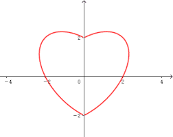

# 重要性质
## 线性性质
同普通积分一样线性可拆，同一区域上$$f=f_1+f_2$$
## 积分可加性
同一积分的不同区域可加$$ D=D_1+D_2$$
## 积分的保号性
若$$f(x,y)\le g(x,y)$$
则有$$ \iint_Df(x,y)\le\iint_Dg(x,y)$$
且有$$ \left|\iint_Df(x,y)d_\sigma\le\iint_D\left|f(x,y)d_\sigma\right|\right|$$
# 普通对称性和轮换对称性
## 普通对称性
设D关于y轴对称，如图

且$f(x,y)=f(-x,y)$
可以得知$(-x,y)$处的积分等于$(x,y)$处
积分只需要算$D_1$(右侧范围)即可

若$f(x,y)=-f(-x,y)$
可以得知$(-x,y)$处的积分等于$(x,y)$处的相反数
积分得零

dui

&nbsp;
&nbsp;
&nbsp;
&nbsp;
&nbsp;
&nbsp;
&nbsp;&nbsp;&nbsp;
&nbsp;
&nbsp;
&nbsp;
&nbsp;
结尾

